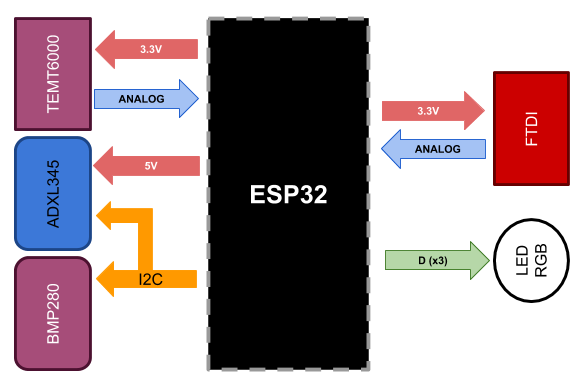
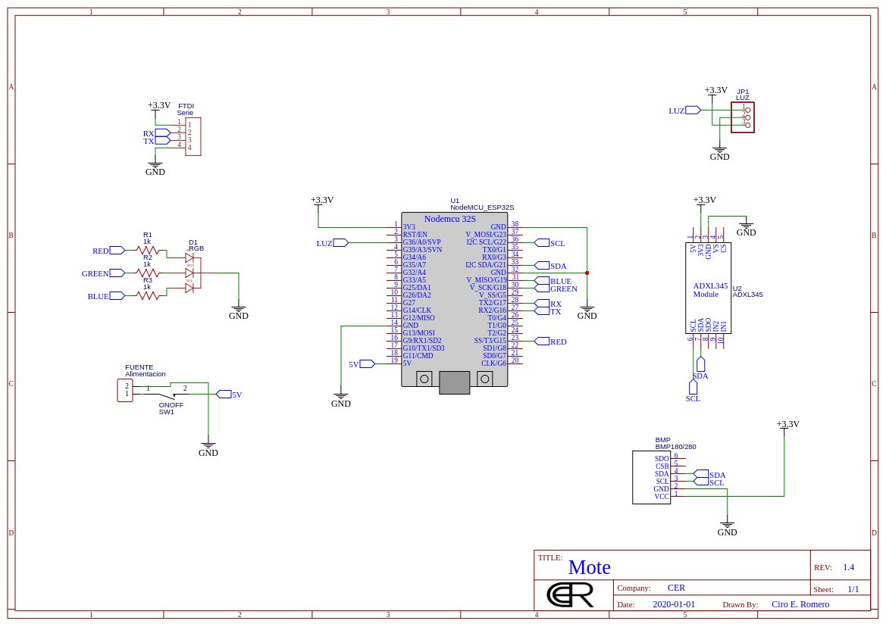

# Sensopy
 
Dispositivo capaz de realizar medición de variables ambientales, con autonomía de batería, capaz enviar la información a través de  WIFI.

## Tecnologias
 - ESP32
 - Micropython

## Esquema de conexion

Sistema embebido basado en la placa ESP32 con compilador e interprete en Micropython. El dispositivo cuenta con varios módulos integrados para realizar cada una de las características necesarias.

El [esquematico](doc/Schematic.pdf) para el armado del dispositivos se encuentra en el repositorio.
